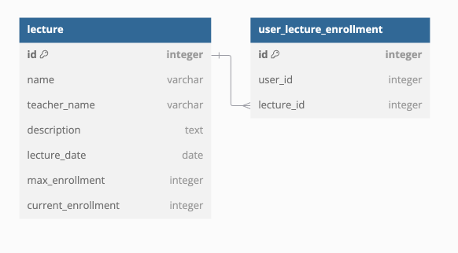

# 테이블 설계

강의 정보를 저장하는 lecture, 강의 신청 정보를 저장하는 user_lecture_enrollment 테이블을 작성하였습니다. 원래는 user 테이블도 별도로 있었으나 회원가입이나 로그인 및 유저 정보를 내려주는 기능이 없기 때문에, id 만 있는 테이블이 되어 존재하는 의미가 거의 없다고 생각하여 제외하였습니다.

## lecture Table 
### lecture_date
강의 시간은 고정되어있다고 가정하고, 강의 날짜만 저장하기 위해 date 로 저장하였습니다. 현재 요구사항에서는 신청가능한 강의를 가져오는 조건이 명시되어 있지 않아 하루 전이면 신청 가능하다고 가정하였습니다.

### max_enrollment, current_enrollment
최대 신청 가능 인원과 현재 신청 인원을 저장하기 위해 max_enrollment, current_enrollment 두 개의 컬럼을 추가하였습니다.

max_enrollment 는 요구사항 상으로는 30명 고정이지만 확장성을 고려야 별도로 추가하였습니다.

current_enrollment 는 user_lecture_enrollment 의 개수를 구하면 알 수 있으나, 현재 요구사항에서는 신청 가능 인원을 가져오는 것이 주요 기능이고, 해당 작업이 있을 때 마다 count 또는 join 을 하는것을 불필요하다고 판단하였습니다.

또 현재 row 기준으로 write lock 을 걸어 동시성을 제어함과 동시에 current_enrollment 값 증가를 하면 되기에, 또한 자동으로 동시성이 보장됩니다.

## user_lecture_enrollment Table
lecture table 에 enrollment_user_id_list 와 같은 컬럼을 추가하여 대응은 가능하지만, 그렇게 설계하게 될 경우 특정 유저가 수강한 강의를 가져오기 위해서는 모든 row 를 조사해야 하는 단점이 있습니다.

그래서 user_lecture_enrollment 테이블을 따로 만들어, 각 유저가 수강한 강의를 where 조건으로 가져올 수 있도록 설계하였습니다.

